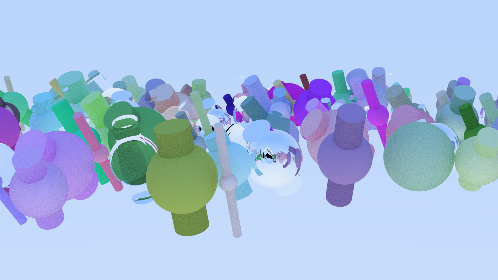

# Renderizado 3D — Arquitectura de Computadores (UC3M)

Proyecto académico de la asignatura **Arquitectura de Computadores** de la **Universidad Carlos III de Madrid (UC3M)** para la implementación y renderizado de escenas 3D mediante trazado de rayos.


## Descripción

El repositorio contiene una implementación de renderizado 3D con:

- **Librería común** (`common/`) para geometría, materiales, parseo de configuración y escena.
- **Variante paralela** (`par/`) con ejecutable `render-par`.
- **Pipeline SOA (Structure of Arrays)** en la ruta `par/`.

> En el estado actual de esta rama, la variante explícita disponible para ejecución es **PAR con implementación SOA**. No se ha identificado un ejecutable AOS separado en esta rama.

## Características principales

- Renderizado de escenas con esferas y cilindros.
- Materiales mate, metálicos y refractivos.
- Paralelización del render con **oneTBB**.
- Configuración de semillas, cámara y parámetros de imagen mediante archivos `.cfg` y `.txt`.
- Pruebas unitarias con GoogleTest para la librería común.

## Requisitos

- Compilador C++ compatible con **C++23** (en presets se usa `g++`).
- **CMake 4.0+** (el proyecto declara `cmake_minimum_required(VERSION 4.0)`).
- **Ninja** (generador configurado en presets).
- **oneTBB** (requerido por `find_package(TBB REQUIRED)`).
- Python 3 para scripts de pruebas.

## Compilación

Comandos recomendados (manteniendo los existentes):

```bash
cmake --preset=default
cmake --build out/build/default --target render-par
```

## Ejecución

Ejemplo de ejecución (existente):

```bash
./out/build/default/par/Release/render-par archivos_ejemplo/config1.cfg archivos_ejemplo/scene1.txt output_soa_ejemplo.ppm
```

### Parámetros opcionales de `render-par`

Sintaxis:

```bash
render-par <config> <scene> <output> [threads] [partitioner] [grain_rows] [grain_cols]
```

Comportamiento real (ver `par/src/main.cpp` y `par/src/render_soa.cpp`):

- `threads` (arg4): número máximo de hilos. Si `<= 0`, se fuerza a `1`.
- `partitioner` (arg5): estrategia de partición en TBB:
  - `simple`
  - `static`
  - `auto`
  - cualquier otro valor cae en `auto`.
- `grain_rows` (arg6): tamaño de bloque por filas, ajustado al rango `[1, alto_imagen]`.
- `grain_cols` (arg7): tamaño de bloque por columnas, ajustado al rango `[1, ancho_imagen]`.

Si no se pasan al menos los 3 argumentos obligatorios, el binario usa valores por defecto:

- `archivos_ejemplo/config5.cfg`
- `archivos_ejemplo/scene5.txt`
- `output_soa5.ppm`

## Pruebas unitarias

Se mantiene la instrucción original:

```bash
python3 utest.py
```

En esta copia del repositorio, el script disponible está en:

```bash
python3 utcommon/utest-common.py
```

## Estructura del repositorio

- `common/`: utilidades y lógica compartida del motor.
- `par/`: ejecutable paralelo `render-par` y render en formato SOA.
- `utcommon/`: pruebas unitarias y script auxiliar de ejecución.
- `archivos_ejemplo/`: escenas, configuraciones y renders de referencia.
- `docs/images/`: galería de resultados incluida en este README.

## Galería de resultados

### 1) Render con varios objetos geométricos sobre un plano


### 2) Objeto compuesto verde y azul sobre fondo claro


### 3) Escena con numerosos objetos geométricos coloreados



## Notas

- Proyecto orientado a práctica académica.
- Para mantener consistencia, se recomienda usar los presets de CMake definidos en el repositorio.

## Licencia

Este repositorio incluye un archivo `LICENSE` con licencia **Apache 2.0**.
